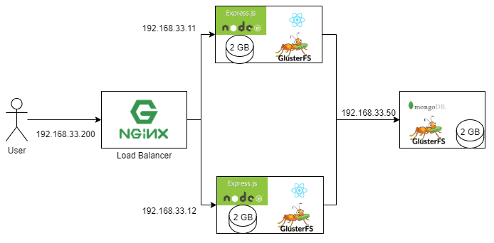
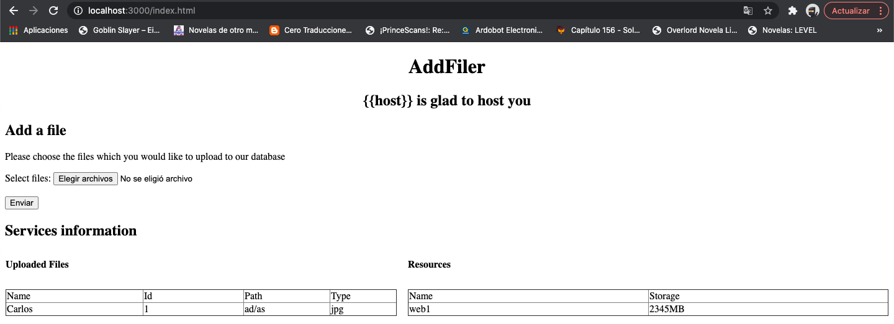
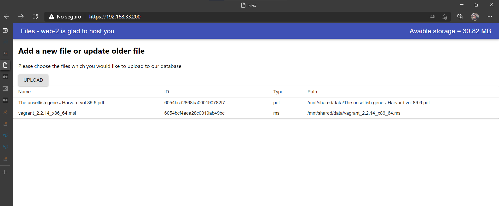

# Midterm 1

## Participants
- Carlos Eduardo Lizalda Valencia
- Brayan S. Garces
- Carlos Heyder Gonzales

## Branching Strategy 


## Overall Operation 


## Vagrant initial Configuration
 First we will be creating the web servers machines, using the following code 
 - Web 1 IP: 192.168.33.11
 - Web 2 IP: 192.168.33.12

``` ruby
Vagrant.configure("2") do |config|

  (1..2).each do |i|
    config.vm.define "web-#{i}" do |web|
      web.vm.box = "centos/7"
      web.vm.hostname = "web-#{i}"
      web.vm.network "private_network", ip: "192.168.33.1#{i}"
      web.vm.provider "virtualbox" do |vb|
        vb.customize ["modifyvm", :id, "--memory", "512", "--cpus", "1", "--name", "web-#{i}"]
      end
    
    end
   end
```

 Then we will be creating the data base that will be used in the architecture

``` ruby
  config.vm.define "db" do |db|
    db.vm.box = "centos/7"
    db.vm.hostname = "db"
    db.vm.network "private_network", ip: "192.168.33.50"
    db.vm.provider "virtualbox" do |vb|
      vb.customize ["modifyvm", :id, "--memory", "512", "--cpus", "1", "--name", "db"]
      unless File.exist?(dbDisk)
        vb.customize ['createhd', '--filename', dbDisk, '--variant', 'Fixed', '--size', 2 * 1024]
      end
      vb.customize ['storageattach', :id,  '--storagectl', 'IDE', '--port', 1, '--device', 0, '--type', 'hdd', '--medium', dbDisk]
    end 
  end  
```

 Next the load balancer creation 

``` ruby
  config.vm.define "lb" do |lb|
    lb.vm.box = "centos/7"
    lb.vm.hostname = "lb"
    lb.vm.network "private_network", ip: "192.168.33.200"
    lb.vm.provider "virtualbox" do |vb|
     vb.customize ["modifyvm", :id, "--memory", "512", "--cpus", "1", "--name", "lb"]
    end
  end
```

## Gluster Configuration

### Disks creation

 So first we created a variable that contains the name that will be given to the new web servers disks

```ruby
def webDisk(num)
  return "./storage/Disk#{num}.vdi"
end
```

 Then another one for the db disk

```ruby
dbDisk = './storage/dbDisk.vdi'
```
 Next we will be creating and mounting the disk for each of the web servers, as shown in the following code, as we can see, in the first part is checked wether or not a disk exist, and if it doesnt is created, and next mounted on the web servers (the same proccess is followed in the data base, just using the variable created for it) 

 ```ruby
unless File.exist?(webDisk(i))
    vb.customize ['createhd', '--filename', webDisk(i), '--variant', 'Fixed', '--size', 2 * 1024]
  end
  vb.customize ['storageattach', :id,  '--storagectl', 'IDE', '--port', 1, '--device', 0, '--type', 'hdd', '--medium', webDisk(i)]
end
 ```


 First we created a folder to save the playbooks
```bash
# Create ansible playbooks folder
mkdir ./playbooks
# create subfolder to glusterfs playbooks
mkdir ./playbooks/glusterfs
# Create inportant subfolders
mkdir ./playbooks/vars
mkdir ./playbooks/glusterfs/templates
```
 Then create the glusterfs variables file 🧾 
Open the file with any editor (in this example  I use VSCode)
``` bash
code ./playbooks/vars/variables.yml
```
Here we storage the IPs of the master node (database), its workers  (web-servers),the mount folder for the sdb1 filesystem and the load balancer
```yaml
lb: "192.168.33.200"
master: "192.168.33.50"
node1: "192.168.33.11"
node2: "192.168.33.12"
fsMount: "/gluster/data"
volumeName: "gv0"
sharedFolder: "/mnt/shared"
```
### Now we need to set up the /etc/hosts file with the nodes hostnames
We need to create a templeate to generate this file
Open the file whith any editor (in this example  I use VSCode)
``` bash
code ./playbooks/glusterfs/templates/hosts.j2
```
We need to define hname in vagrant file, we will do this later
```jinja
127.0.0.1   localhost localhost.localdomain localhost4 localhost4.localdomain4
::1         localhost localhost.localdomain localhost6 localhost6.localdomain6
127.0.1.1 {{ hname }} {{ hname }}
{{ master }}	master
{{ node1 }}	node1
{{ node2 }}	node2
``` 
### Now we are ready to install and configure gluster in all the nodes (includig master)

First we need to create the glusterfs yaml file
Open the file with any editor (in this example  I use VSCode)
``` bash
code ./playbooks/glusterfs/glusterfs.yml
```
First we created the partition and filesystem as pretasks
```yaml
---
- hosts: all
  become: true
  vars_files:
    - ../vars/variables.yml
  pre_tasks:
    - name: create partition
      parted:
        device: /dev/sdb
        number: 1
        state: present
    - name: create filesystem
      filesystem:
        fstype: xfs
        dev: /dev/sdb1
    - name: Create a directory if it does not exist
      file:
        path: "{{ fsMount }}"
        state: directory
        mode: '0755'
```

Then we installed all the glusterfs packages using yum and started the service

```yaml
    - name: Install glusterfs
      yum:
        name:
          - "{{ item }}"
      with_items:
        - centos-release-gluster
        - glusterfs-server
        - xfsprogs
    - name: Ensure the GlusterFS service is running (CentOS)
      service: name=glusterd state=started
```

Finally we mounted the file system and loaded the hosts file

```yaml
  tasks:
    - name: mount filesystem
      mount:
        path: "{{ fsMount }}"
        src: /dev/sdb1
        fstype: xfs
        state: mounted
    - name: Set /etc/hosts using template
      action: template dest=/etc/hosts src=templates/hosts.j2 owner=root group=root
```
The glusterfs playbook is mounted onto the web servers using the following code
```ruby
web.vm.provision "ansible" do |ansible|
  ansible.playbook = "playbooks/glusterfs/glusterfs.yml"
  ansible.extra_vars = {
    hname: "web-#{i}"
  }
end
```
And next the glusterfs playbook created for the data base were mounted too, as shown below

```ruby
db.vm.provision "ansible" do |ansible|
    ansible.playbook = "playbooks/glusterfs/glusterfs.yml"
    ansible.extra_vars = {
        hname: "db"
    }
  end  
```

On the other hand, the master.yml file is executed on the db type hosts, creating a gluster volume, with 3 copies of it, and then, execute that gluster volume

```yaml
- hosts: db
  become: true
  vars_files:
    - ../vars/variables.yml
  tasks:
    - name: create gluster volume
      gluster_volume:
        state: present
        name: "{{ volumeName }}"
        bricks: "{{ fsMount }}/{{ volumeName }}"
        replicas: 3
        cluster: ["node1", "node2", "master"]
      run_once: true
    - name: Start Gluster volume
      gluster_volume: name={{ volumeName }} state=started
```

The following code shows the host gluster which is used for installing the volume gluster in each of the host

```yaml
---
- hosts: all
  become: true
  vars_files:
    - ../vars/variables.yml
  pre_tasks:
    - name: Create a directory if it does not exist
      file:
        path: "{{ sharedFolder }}"
        state: directory
        mode: '0755'
  tasks:
    - name: Start Gluster volume
      shell: mount.glusterfs localhost:/{{ volumeName }} {{ sharedFolder }}
      run_once: true
```

In the pretask the sharedFolder is created, a directory with 755 permissions for it to execute the tasks, which consists in start the gluster and mount the defined volumes.

The client gluster is installed in the web servers(media inventory) and the data base, as shown below

```ruby
 db.vm.provision "ansible" do |ansible|
  ansible.playbook = "playbooks/glusterfs/client.yml"
  ansible.limit = 'all'
  ansible.inventory_path = 'hosts_inventory'
end 
```
As shown below, this code install a functional docker

```yml
- hosts: all
  become: true
  vars_files:
    - ../vars/variables.yml
  tasks:
    - name: Install yum utils
      yum:
        name: yum-utils
        state: latest
    - name: Install device-mapper-persistent-data
      yum:
        name: device-mapper-persistent-data
        state: latest
    - name: Install lvm2
      yum:
        name: lvm2
        state: latest
    - name: Add Docker repo
      get_url:
        url: https://download.docker.com/linux/centos/docker-ce.repo
        dest: /etc/yum.repos.d/docer-ce.repo
    - name: Enable Docker Edge repo
      ini_file:
        dest: /etc/yum.repos.d/docer-ce.repo
        section: 'docker-ce-edge'
        option: enabled
        value: 0
    - name: Enable Docker Test repo
      ini_file:
        dest: /etc/yum.repos.d/docer-ce.repo
        section: 'docker-ce-test'
        option: enabled
        value: 0
    - name: Install Docker
      package:
        name: docker-ce
        state: latest
    - name: Start Docker service
      service:
        name: docker
        state: started
        enabled: yes
    - name: Add user vagrant to docker group
      user:
        name: vagrant
        groups: docker
        append: yes
```
Next the code for the docker as shown below, mounted onto the data base

```ruby
db.vm.provision "ansible" do |ansible|
  ansible.playbook = "playbooks/docker/docker.yml"
  ansible.limit = 'all'
  ansible.inventory_path = 'hosts_inventory'
end
```

As shown below the db.yml stop and delete the container in case there is already one running, and then starts a new container, passing onto it the gluster volume, and then download mongo
```yml
- hosts: db
  become: true
  vars_files:
    - ../vars/variables.yml
  pre_tasks:
    - name: Create a directory if it does not exist
      file:
        path: "{{sharedFolder}}/db"
        state: directory
        mode: '0755'
  tasks:  
    - name: Stop docker db container
      shell: docker stop db || true
    - name: remove docker db container
      shell: docker rm db || true
    - name: Start docker db continer
      shell: docker run -d --name db -v {{sharedFolder}}/db:/data/db -p 27017:27017 mongo:4.4.4
```
Next the playbook db.yml is mounted onto the db in the Vagrant file

```ruby
db.vm.provision "ansible" do |ansible|
  ansible.playbook = "playbooks/db/db.yml"
end  
```
The webserver.yml has a similar construct as the db, checking if theres a running docker, stopping it and deleting it in case there is, and then creating a new one with the cluster of gluster and a bunch of enviroment variables (these variables are hostname, the load balancer IP, the data base IP and the path to the sharedfolder)
 ```yml
 ---
- hosts: webservers
  become: true
  vars_files:
    - ../vars/variables.yml
  pre_tasks:
    - name: Create a directory if it does not exist
      file:
        path: "{{sharedFolder}}/data"
        state: directory
        mode: '0755'
  tasks:  
    - name: Stop docker back container
      shell: docker stop back || true
    - name: remove docker back continer
      shell: docker rm back || true
    - name: pull back continer
      shell : docker pull zeronetdev/sd-exam-1-back
    - name: Start docker back continer
      shell: docker run --name back -d -p 3000:3000 -v {{sharedFolder}}:{{sharedFolder}} -e STORAGE={{sharedFolder}}/data -e DB_IP={{master}} -e HOST=$HOSTNAME -e LB={{lb}} zeronetdev/sd-exam-1-back
 ``` 

Then the playbook is mounted onto the db
```ruby
db.vm.provision "ansible" do |ansible|
  ansible.playbook = "playbooks/webserver/webserver.yml"
  ansible.limit = 'all'
  ansible.inventory_path = 'hosts_inventory'
end
```
For the load balencer the following main.yml is needed
```yml
- hosts: lb
  become: true
  vars_files:
    - vars/main.yml
  pre_tasks:
    - name: Ensure epel repository exists
      yum: name=epel-release
    - name: Install openssl dependencies
      yum: 
        name:
          - openssl-devel
    - name: Turn on firewalld
      service: name=firewalld state=started enabled=yes
    - name: install pip
      yum: name=python-pip state=latest
    - name: upgrade pip
      shell: pip install --upgrade "pip < 21.0"
    - name: Install pip3 depden
      pip:
        name: pyopenssl

  tasks:
    - import_tasks: tasks/self-signed-cert.yml
    - name: Install nginx 
      yum:
        name:
          - nginx
    - name: Enable firewall
      shell: "firewall-cmd --permanent --add-service={http,https}"
    - name: Start firewall rule
      shell: "firewall-cmd --reload"
    - name: Nginx configuration server
      template:
        src: templates/nginx.conf.j2
        dest: /etc/nginx/nginx.conf
        mode: 0644
    - name: Restart nginx
      service: name=nginx state=restarted enabled=yes
    - name: Configure SO to allow to nginx make the proxyredirect
      shell: setsebool httpd_can_network_connect on -P
```
Next this playbook is mounted onto the load balancer as shown below

```ruby
lb.vm.provision "ansible" do |ansible|
  ansible.playbook = "playbooks/nginx/main.yml"
  ansible.extra_vars = {
      "web_servers" => [
      {"name": "web-1","ip":"192.168.33.11"},
      {"name": "web-2","ip":"192.168.33.12"}
      ] 
  }
end  
```
## Frontend

The first frontend we tough of using was the page shown below



Later, for ease of use and comodity we decided to refactor it using React, to end up looking as follows




